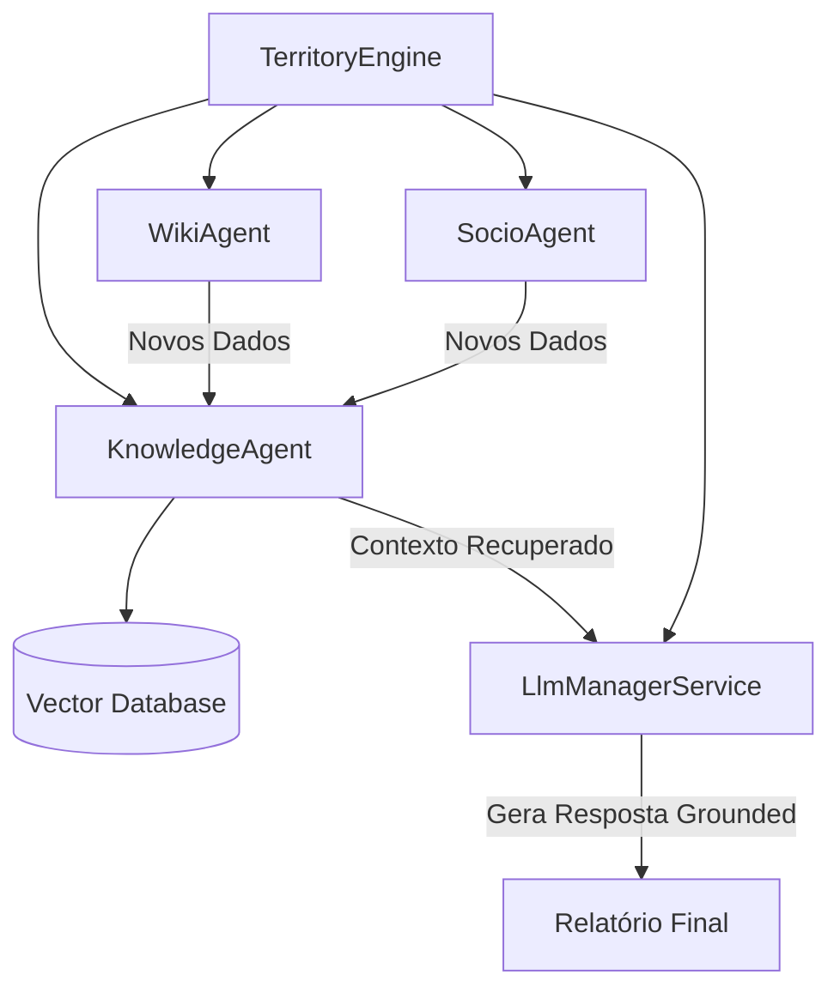

# PLANO DE IMPLEMENTAÇÃO: Raio-X RAG (Retreival-Augmented Generation)

## Visão Geral
Transformar o Raio-X em um sistema que não apenas busca dados "frios" (APIs), mas que possui uma **Memória Territorial Semântica**. Isso permitirá que o sistema aprenda sobre as regiões ao longo do tempo, indexe documentos complexos (como Planos Diretores Municipais) e forneça narrativas muito mais ricas e precisas.

## Objetivos
1. Implementar uma camada de **Vector Database** para armazenamento de conhecimento geográfico.
2. Criar o `KnowledgeAgent` (Padrão Lumina) para gerenciar embeddings.
3. Indexar dados históricos e culturais para reduzir a dependência de chamadas repetitivas à Wikipedia.
4. Permitir o upload e indexação de documentos técnicos (PDFs de zoneamento, notícias locais).

---

## 📅 Roadmap de Implementação

### Fase 1: Fundação de Conhecimento (Infraestrutura)
- [ ] Escolha do Vector Store (Sugestão: **Pinecone** para simplicidade ou **Qdrant** para performance).
- [ ] Configuração do serviço de Embeddings (OpenAI `text-embedding-3-small` ou Google `embedding-004`).
- [ ] Criação do `KnowledgeAgent v1.0.0` no diretório `app/Services/Agents`.

### Fase 2: Indexação Territorial
- [ ] Criar Job `IndexCityKnowledge` para processar e vetorizar textos da Wikipedia e IBGE já coletados.
- [ ] Implementar tags geo-espaciais nos vetores (Latitude/Longitude) para buscas por proximidade (Busca Híbrida).
- [ ] Criar comando Artisan `ai:index-territory` para indexação em massa.

### Fase 3: Integração na TerritoryEngine
- [ ] Modificar a `TerritoryEngine` para consultar o `KnowledgeAgent` antes de buscar dados externos.
- [ ] Implementar a lógica de "Augmentation": O contexto recuperado do Vector DB é injetado no prompt do `GenerateNeighborhoodText`.
- [ ] Priorizar o conhecimento interno da plataforma sobre o conhecimento geral da IA.

### Fase 4: Inteligência Avançada (RAG Pro)
- [ ] Interface para upload de documentos (PDF/Texto) por cidade.
- [ ] Sistema de "Citações": A narrativa da IA deve citar a fonte do conhecimento recuperado.
- [ ] Dashboard de Memória Territorial para o administrador ver o que o sistema "sabe".

---

## 🏗️ Arquitetura Sugerida (Padrão Micro-Agentes)

## Próximos Passos
1. **Definição do Provedor**: Você prefere uma solução gerenciada (Pinecone/OpenRouter) ou algo local (SQLite-vss/Postgres)?
2. **Aprovação do Plano**: Posso começar criando a estrutura base do `KnowledgeAgent`?
